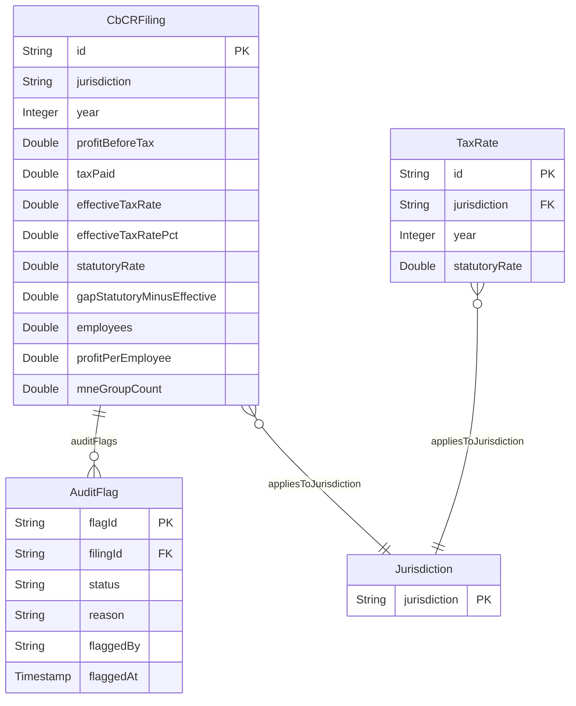

# CbCR Tax Rate Analysis — Foundry Pipeline

Country-by-Country Reporting (CbCR) tax compliance pipeline built on Palantir Foundry. Ingests OECD CbCR and OECD Corporate Income Tax (CIT) statutory rate data, computes effective vs. statutory tax rate gaps per jurisdiction-year, identifies audit candidates via a QUALIFY-style pattern, and exposes an Ontology-backed workflow for manually flagging filings for review.

---

## Table of Contents

- [Pipeline Architecture](#pipeline-architecture)
- [Datasets](#datasets)
- [Core Logic — transform_join.py](#core-logic-transform_joinpy)
- [Audit Trail Seed — init_audit_flags.py](#audit-trail-seed-init_audit_flagspy)
- [Ontology Model](#ontology-model)
  - [Objects](#objects)
  - [Link Types](#link-types)
  - [Entity-Relationship Diagram](#entity-relationship-diagram)
  - [Action Type: FlagForAudit](#action-type-flagforaudit)
- [Merge Status](#merge-status)
- [Requirements](#requirements)
- [Roadmap](#roadmap)

---

## Pipeline Architecture

```
ingest_cbcr.py            → cbcr_raw              → clean_cbcr.py        → cbcr_clean
ingest_tax_rate.py        → tax_rates_raw         → clean_tax_rates.py   → tax_rates_clean
ingest_eurostat.py        → eurostat_tax_gdp_raw  → clean_eurostat.py    → eurostat_tax_gdp_clean

cbcr_clean                → incremental_batches.py → cbcr_incremental_snapshot

cbcr_clean + tax_rates_clean → transform_join.py →  effective_vs_statutory
                                                  →  top10_beps_gap
                                                  →  audit_candidates
                                                  →  jurisdictions_dim
                                                  →  tax_rates_with_id

init_audit_flags.py       → audit_flags  (seed dataset backing the FlagForAudit action)
```

---

## Datasets

| File | Input | Output | Purpose |
|---|---|---|---|
| `ingest_cbcr.py` | OECD SDMX API (`DSD_CBCR@DF_CBCRI`) | `cbcr_raw.csv` | Pulls raw CbCR data from OECD, with retry (3x) and 60s timeout |
| `ingest_tax_rate.py` | OECD SDMX API (`DSD_TAX_CIT@DF_CIT`) | `tax_rates_raw.csv` | Pulls statutory CIT rates per jurisdiction and year |
| `ingest_eurostat.py` | Eurostat API (`gov_10a_taxag`) | `eurostat_tax_gdp_raw.json` | Pulls tax-to-GDP ratio in JSON-stat format |
| `clean_cbcr.py` | `cbcr_raw` | `cbcr_clean` | Renames columns, casts types, drops nulls, deduplicates on `(jurisdiction, counterpart_jurisdiction, measure, year)` |
| `clean_tax_rates.py` | `tax_rates_raw` | `tax_rates_clean` | Renames columns, casts `tax_rate` to double, deduplicates on `(jurisdiction, measure, year)` |
| `clean_eurostat.py` | `eurostat_tax_gdp_raw` | `eurostat_tax_gdp_clean` | Custom JSON-stat parser, filters by tax category and unit of measure (% of GDP) |
| `incremental_batches.py` | `cbcr_clean` | `cbcr_incremental_snapshot` | Splits on-time vs. late-arriving records (7-day lookback), merges and deduplicates |
| `transform_join.py` | `cbcr_clean`, `tax_rates_clean` | `effective_vs_statutory`, `top10_beps_gap`, `audit_candidates`, `jurisdictions_dim`, `tax_rates_with_id` | Aggregates CbCR, pivots measures, joins with statutory rates, computes `effective_tax_rate` and the BEPS gap, applies the QUALIFY audit pattern |
| `init_audit_flags.py` | — | `audit_flags` | Initializes an empty dataset with the audit-trail schema used by the `FlagForAudit` action |

---

## Core Logic — `transform_join.py`

### Step 1 — Aggregation

CbCR is aggregated by `(jurisdiction, year, measure)`:

```python
def aggregate_cbcr_totals(cbcr_df):
    return cbcr_df.groupBy("jurisdiction", "year", "measure").agg(
        F.sum("obs_value").alias("obs_value")
    )
```

### Step 2 — Pivot

Four measures are pivoted into columns:

| Source measure label | Pivoted column |
|---|---|
| `Profit (loss) before income tax` | `profit_before_tax` |
| `Income tax paid (on cash basis)` | `tax_paid` |
| `Employees` | `employees` |
| `Multinational enterprise groups` | `mne_group_count` |

### Step 3 — Computed Metrics

```python
effective_tax_rate            = tax_paid / profit_before_tax          # null-guarded
profit_per_employee           = profit_before_tax / employees          # null-guarded
effective_tax_rate_pct        = effective_tax_rate * 100
gap_statutory_minus_effective = statutory_rate - effective_tax_rate_pct
```

### Step 4 — Statutory Rate Join

Filtered from `tax_rates_clean` where `measure == "Corporate income tax rate"`, renamed to `statutory_rate`, joined on `(jurisdiction, year)`. Both `effective_vs_statutory` and `tax_rates_with_id` carry a synthetic key:

```python
id = F.concat_ws("_", jurisdiction, year.cast("string"))   # format: {jurisdiction}_{year}
```

### Step 5 — BEPS Signal (Top 10)

The merged table is sorted descending by `gap_statutory_minus_effective`; the top 10 rows go to `top10_beps_gap` — the jurisdictions with the largest divergence between nominal and effective tax rates, the classic profit-shifting signal.

### Step 6 — QUALIFY Pattern (Audit Candidates)

`apply_qualify_pattern` reproduces SQL `QUALIFY` using window functions partitioned by `year`:

```python
window_year = Window.partitionBy("year")

median_employees_year       = F.expr("percentile_approx(employees, 0.5)").over(window_year)
q3_profit_per_employee_year = F.expr("percentile_approx(profit_per_employee, 0.75)").over(window_year)

audit_signal = (
    (F.col("employees") > F.col("median_employees_year"))
    & (F.col("profit_per_employee") >= F.col("q3_profit_per_employee_year"))
)
```

Rows where `audit_signal = True` go to `audit_candidates` — jurisdictions with above-median headcount **and** top-quartile profit-per-employee.

### Step 7 — Dimensional Outputs

`jurisdictions_dim` (distinct jurisdiction list) and `tax_rates_with_id` (statutory rates with the synthetic `id`) round out the dimensional layer feeding the Ontology.

---

## Audit Trail Seed — `init_audit_flags.py`

Initializes the `audit_flags` dataset with an explicit empty schema, ready to be written to by the `FlagForAudit` Ontology action:

```python
schema = StructType([
    StructField("flag_id", StringType(), False),
    StructField("filing_id", StringType(), False),
    StructField("reason", StringType(), True),
    StructField("flagged_by", StringType(), True),
    StructField("flagged_at", TimestampType(), True),
    StructField("status", StringType(), True),
])
```

| Column | Type | Nullable |
|---|---|---|
| `flag_id` | String | No |
| `filing_id` | String | No |
| `reason` | String | Yes |
| `flagged_by` | String | Yes |
| `flagged_at` | Timestamp | Yes |
| `status` | String | Yes |

---

## Ontology Model

### Objects

#### CbCRFiling
Aggregated CbCR record per jurisdiction and year with computed tax metrics.

| Property | API Name | Type | Filterable |
|---|---|---|:---:|
| Id | `id` | String | ✅ |
| Jurisdiction | `jurisdiction` | String | ✅ |
| Year | `year` | Integer | – |
| Profit Before Tax | `profitBeforeTax` | Double | – |
| Tax Paid | `taxPaid` | Double | – |
| Effective Tax Rate | `effectiveTaxRate` | Double | – |
| Effective Tax Rate Pct | `effectiveTaxRatePct` | Double | – |
| Statutory Rate | `statutoryRate` | Double | – |
| Gap Statutory Minus Effective | `gapStatutoryMinusEffective` | Double | – |
| Employees | `employees` | Double | – |
| Profit Per Employee | `profitPerEmployee` | Double | – |
| Mne Group Count | `mneGroupCount` | Double | – |

**Primary Key:** `id` (format: `{Jurisdiction}_{Year}`)
**Storage:** OSV2

#### AuditFlag
Manual audit flag raised against a CbCR filing.

| Property | API Name | Type | Filterable |
|---|---|---|:---:|
| Flag Id | `flagId` | String | ✅ |
| Filing Id | `filingId` | String | ✅ |
| Status | `status` | String | ✅ |
| Reason | `reason` | String | ✅ |
| Flagged By | `flaggedBy` | String | ✅ |
| Flagged At | `flaggedAt` | Timestamp | – |

**Primary Key:** `flagId`
**Storage:** OSV2

#### Jurisdiction
Dimension table of all jurisdictions present in the pipeline.

| Property | API Name | Type | Filterable |
|---|---|---|:---:|
| Jurisdiction | `jurisdiction` | String | ✅ |

**Primary Key:** `jurisdiction`
**Storage:** OSV2

#### TaxRate
Statutory corporate income tax rate per jurisdiction and year.

| Property | API Name | Type | Filterable |
|---|---|---|:---:|
| Id | `id` | String | ✅ |
| Jurisdiction | `jurisdiction` | String | ✅ |
| Year | `year` | Integer | – |
| Statutory Rate | `statutoryRate` | Double | – |

**Primary Key:** `id` (format: `{Jurisdiction}_{Year}`)
**Storage:** OSV2

---

### Link Types

| From | To | API Name (from side) | API Name (to side) | Description |
|---|---|---|---:|---|
| CbCRFiling | Jurisdiction | `appliesToJurisdiction` | `cbCrfilings` | Filing belongs to jurisdiction |
| CbCRFiling | AuditFlag | `auditFlags` | `cbCrfiling` | Filing has audit flags |
| TaxRate | Jurisdiction | `appliesToJurisdiction` | `taxRates` | Rate belongs to jurisdiction |

### Entity-Relationship Diagram



### Action Type: `FlagForAudit`

Requires approval; writes a new row to `audit_flags` with `flag_id`, `filing_id`, `reason` (e.g. "effective rate more than 5pp below statutory rate"), `flagged_by`, `flagged_at`, and `status`. Backs the governance/approval workflow demonstrated in Workshop.

| Field | Description |
|---|---|
| Trigger | Manual action on `CbCRFiling` object |
| Approval | Required (e.g. `TAX_MANAGER` role) |
| Writes to | `audit_flags` dataset |
| Audit trail | Captures who flagged, when, and why |

---

## Requirements

- Python 3.9+, PySpark (Foundry runtime)
- `transforms-expectations` library for data quality checks:
  - `profit_before_tax >= 0`
  - `tax_paid <= profit_before_tax`
  - `revenue >= profit_before_tax`
- Configured `external_systems.Source` connections for the OECD SDMX and Eurostat APIs

---
